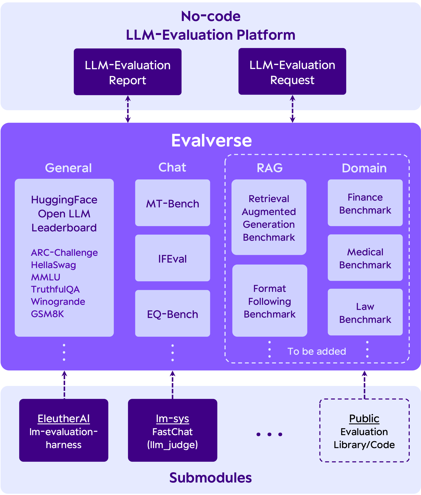
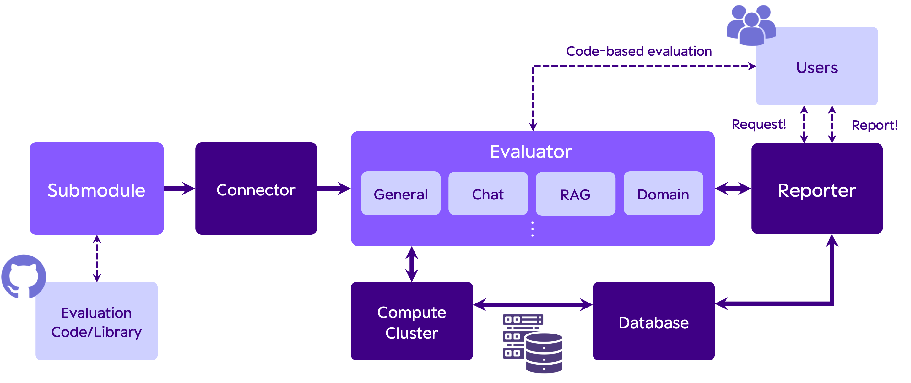

# Evalverse
<div align="center">
<picture>
  <source media="(prefers-color-scheme: dark)" srcset="assets/Evalverse_White.png" width=300>
  <source media="(prefers-color-scheme: light)" srcset="assets/Evalverse_Color.png" width=300>
  
</picture>

The Universe of Evaluation.
All about the evaluation for LLMs.

[Guide]() • [Contact](mailto:evalverse@upstage.ai)
</div>

<div align="center"></div>


## Welcome to Evalverse!
Evalverse is a freely accessible, open-source project designed to support your LLM (Large Language Model) evaluations. We provide a simple, standardized, and user-friendly solution for the processing and management of LLM evaluations, catering to the needs of AI research engineers and scientists. Even if you are not very familiar with LLMs, you can easily use Evalverse.
<div align="center"></div>


## 🌌 Installation
### 🌠 Option 1: Git clone
```
git clone --recursive https://github.com/UpstageAI/evalverse
```
- Notes: `--recursive` for submodules

```
cd evalverse
pip install -e .
```
- Notes: Install the packages at once


### 🌠 Option 2: Install via Pypi \*WIP*
> **Currently, pip install is not supported. Please install Evalverse with option 1.**

(TBD)


## 🌌 Configuration
`.env` file (rename `.env_sample` to `.env`)
- Your OpenAI API Key (required for `mt_bench`)
- Your Slack BOT/APP Token (required for slack reporter)
```
OPENAI_API_KEY=sk-...

SLACK_BOT_TOKEN=xoxb-...
SLACK_APP_TOKEN=xapp-...
```

## 🌌 Evaluation
### Arguments
```
python3 evaluator.py --{arguments}
```
Common Args
- `ckpt_path` (default="upstage/SOLAR-10.7B-Instruct-v1.0")
  - Model name or or ckpt_path
- `output_path` (default="./results")
  - Path to save evaluation results
- `model_name` (default="SOLAR-10.7B-Instruct-v1.0")
  - model name used in saving eval results
- `use_fast_tokenizer` (default=False)
  - Flag to use fast tokenizer
- `use_flash_attention_2` (default=False)
  - Flag to use flash attention 2 (highly suggested)

Args for `lm-evaluation-harness`
- `h6_en` (default=False)
  - Evaluate a LLM with the benchmarks in Open LLM Leaderbaord
  -  ARC, HellaSwag, MMLU, TruthfulQA, Winogrande, GSM8K
- `use_vllm` (default=False): Inference with vLLM
- `model_parallel` (default=1): Size of model_parallel
- `data_parallel` (default=1): Size of data_parallel

Args for `FastChat` 
- `mt_bench` (default=False)
  - Evaluate a LLM with MT-Bench
  - Required: OpenAI API Key (in `.env`)
- `baselines` (defulat=None): The baseline LLMs to compare
- `judge_model` (default="gpt-4")
- `num_gpus_per_model` (default=1): The number of GPUs per model (for gen_answer)
- `num_gpus_total` (default=1): The total number of GPUs (for gen_answer)
- `parallel_api` (default=1): The number of concurrent API calls (for gen_judge)

Args for `IFEval`
- `ifeval` (default=False)
  - Evaluate a LLM with Instruction Following Eval
- `gpu_per_inst_eval` (default=1)
  - Num GPUs per ifeval process. Set to > 1 for larger models. Keep `len(devices) / gpu_per_inst_eval = 1` for repeatable results
  
Args for `EQ-Bench`
- `eq_bench` (default=False)
  - Evaluate a LLM with EQ-Bench
- `eq_bench_prompt_type` (default="ChatML")
  - Set chat template. 
    - TODO: Refactor to use tokenizer.apply_chat_template
- `eq_bench_lora_path` (default=None)
  - Path to LORA adapters
- `eq_bench_quantization` (default=None)
  - Whether to quantize the LLM when loading

### Examples
<details>
<summary>h6_en</summary>

```
python3 evaluator.py \
    --h6_en \
    --data_parallel 8 \
    --ckpt_path upstage/SOLAR-10.7B-Instruct-v1.0
```
</details>

<details>
<summary>mt_bench</summary>

```
python3 evaluator.py \
    --mt_bench \
    --num_gpus_total 8 \
    --parallel_api 4 \
    --ckpt_path upstage/SOLAR-10.7B-Instruct-v1.0
```
</details>

<details>
<summary>ifeval</summary>

```
python3 evaluator.py \
    --ifeval \
    --devices 0,1,2,3,4,5,6,7 \
    --ckpt_path upstage/SOLAR-10.7B-Instruct-v1.0
```
</details>

<details>
<summary>EQ-Bench</summary>

```
python3 evaluator.py \
    --eq_bench \
    --devices 0,1,2,3,4,5,6,7 \
    --ckpt_path upstage/SOLAR-10.7B-Instruct-v1.0
```
</details>

<details>
<summary>All</summary>

```
python3 evaluator.py \
    --h6_en \
    --data_parallel 8 \
    --mt_bench \
    --num_gpus_total 8 \
    --parallel_api 4 \
    --ifeval \
    --eq_bench \
    --devices 0,1,2,3,4,5,6,7 \
    --ckpt_path upstage/SOLAR-10.7B-Instruct-v1.0
```
</details>


## 🌌 Contributors
(TBD)

## 🌌 Acknowledgements

Evalverse is an open-source project orchestrated by the **Data-Centric LLM Team** at `Upstage`, designed as an ecosystem for LLM evaluation. Launched in March 2024, this initiative stands at the forefront of advancing evaluation handling in the realm of large language models (LLMs).

## 🌌 License
Evalverse is completely freely-accessible open-source and licensed under the Apache License 2.0.


## 🌌 Citation
> If you want to cite our 🌌 Evalverse project, feel free to use the following bibtex

```bibtex
@misc{evalverse,
  title = {Evalverse},
  author = {Jihoo Kim, Wonho Song, Dahyun Kim, Yoonsoo Kim, Yungi Kim, Chanjun Park},
  year = {2024},
  publisher = {GitHub, Upstage AI},
  howpublished = {\url{https://github.com/UpstageAI/evalverse}},
}
```
